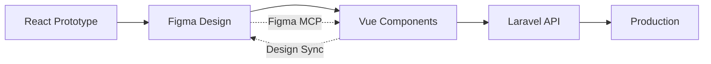

# 📋 Figma Export & Production Integration Checklist

## 🎯 Overview

This checklist guides you through exporting the ChurchAfrica ChMS prototype to Figma Design and integrating it into your production environment via Figma MCP server.

**Your Tools:**
- ✅ Cursor IDE
- ✅ AugmentCode AI
- ✅ Claude Code (GLM-4.6 LLM from z.ai)
- ✅ Figma MCP Server
- ✅ HTML-to-Design Plugin (or similar)

---

## ✅ Pre-Export Preparation

### **1. Verify Completeness**

- [x] ✅ All 15 phases implemented
- [x] ✅ 100+ components built
- [x] ✅ Event management fully covered
- [x] ✅ Member portal complete
- [x] ✅ All documentation written
- [x] ✅ API specification complete
- [x] ✅ Vue migration guide ready

### **2. Documentation Review**

- [x] ✅ PROJECT_HANDOFF.md
- [x] ✅ API_SPECIFICATION.md
- [x] ✅ VUE_MIGRATION_GUIDE.md
- [x] ✅ HANDOFF_SUMMARY.md
- [x] ✅ FIGMA_EXPORT_CHECKLIST.md (this file)
- [x] ✅ All component READMEs
- [x] ✅ Phase completion docs (13-15)

### **3. Code Quality Check**

```bash
# Run these checks before export
npm run build          # Verify build succeeds
npm run type-check     # TypeScript validation
npm run lint           # ESLint check
# npm run test        # Run tests (if implemented)
```

Expected results:
- ✅ Build: SUCCESS
- ✅ TypeScript: 0 errors
- ✅ ESLint: 0 errors
- ⚠️  Tests: (Not implemented in prototype)

---

## 🎨 Figma Export Methods

### **Method 1: HTML-to-Design Plugin** (Recommended)

**Pros:**
- Direct conversion from running app
- Preserves interactions
- Maintains component structure
- Fastest method

**Steps:**

1. **Install Plugin**
   ```
   Figma → Plugins → Browse Plugins → Search "HTML to Design"
   Install: "HTML to Design (by Builder.io)" or similar
   ```

2. **Run Development Server**
   ```bash
   npm run dev
   # Server starts at http://localhost:5173
   ```

3. **Export Each Module**
   - Dashboard → Export as "Dashboard"
   - Members → Export as "Members"
   - Attendance → Export as "Attendance"
   - Events → Export as "Events"
   - Giving → Export as "Giving"
   - Chat → Export as "Chat"
   - Organization → Export as "Organization"
   - Member Portal → Export as "Member Portal"
   - Reports → Export as "Reports"
   - Analytics → Export as "Analytics"

4. **Organize in Figma**
   ```
   ChurchAfrica ChMS/
   ├── 📱 Screens/
   │   ├── Dashboard
   │   ├── Members
   │   ├── Attendance
   │   ├── Events
   │   ├── Giving
   │   ├── Chat
   │   ├── Organization
   │   ├── Member Portal
   │   ├── Reports
   │   └── Analytics
   ├── 🎨 Components/
   │   ├── UI Components
   │   ├── Forms
   │   ├── Cards
   │   └── Navigation
   ├── 🎭 Styles/
   │   ├── Colors
   │   ├── Typography
   │   └── Effects
   └── 📚 Documentation/
       └── README (paste HANDOFF_SUMMARY.md)
   ```

---

### **Method 2: Figma MCP Server Import** (Advanced)

**Pros:**
- Direct integration with dev environment
- Automated sync
- Component mapping
- Version control

**Prerequisites:**
- Figma MCP Server configured
- Cursor IDE with Figma extension
- API keys configured

**Steps:**

1. **Configure Figma MCP Server**
   ```bash
   # In your terminal
   figma-mcp configure
   # Enter Figma Personal Access Token
   # Select ChurchAfrica ChMS file
   ```

2. **Export Component Definitions**
   ```typescript
   // Create figma.config.ts
   export const figmaConfig = {
     fileId: 'YOUR_FIGMA_FILE_ID',
     components: {
       'Dashboard': '/components/dashboard',
       'MemberList': '/components/members',
       'AttendanceTracker': '/components/attendance',
       'EventCalendar': '/components/events',
       // ... all components
     },
     styles: {
       colors: '/styles/globals.css',
       typography: '/styles/globals.css',
     }
   };
   ```

3. **Sync to Figma**
   ```bash
   figma-mcp sync --config figma.config.ts
   ```

4. **Pull from Figma (In Production)**
   ```bash
   figma-mcp pull --component=Dashboard
   # Generates Vue components from Figma designs
   ```

---

### **Method 3: Manual Design Recreation** (Most Control)

**Pros:**
- Pixel-perfect results
- Designer can optimize
- Custom animations
- Brand refinement

**Steps:**

1. **Take Screenshots**
   - Use DevNavigation to navigate
   - Screenshot each page at desktop (1920x1080)
   - Screenshot each page at mobile (375x667)
   - Export as PNG (high quality)

2. **Create Figma Frames**
   ```
   Desktop: 1920 x 1080
   Tablet: 768 x 1024
   Mobile: 375 x 667
   ```

3. **Recreate Designs**
   - Use screenshots as reference
   - Match colors exactly (use #1CE479, #0A0A0F, etc.)
   - Use Archivo font
   - Maintain spacing (check code for Tailwind classes)

4. **Create Components**
   - Button variants (Primary, Secondary, Ghost, etc.)
   - Input fields
   - Cards
   - Navigation menus
   - All reusable elements

5. **Link Documentation**
   - Add notes to each frame
   - Link to component README
   - Add interaction notes

---

## 🔄 Figma MCP Server Integration

### **Setup for Production Development**

1. **Install Figma MCP Server**
   ```bash
   npm install -g @figma/figma-mcp-server
   ```

2. **Configure in Project**
   ```json
   // package.json
   {
     "scripts": {
       "figma:pull": "figma-mcp pull",
       "figma:push": "figma-mcp push",
       "figma:sync": "figma-mcp sync"
     }
   }
   ```

3. **Environment Variables**
   ```env
   # .env.local
   FIGMA_PERSONAL_ACCESS_TOKEN=your_token_here
   FIGMA_FILE_ID=your_file_id_here
   FIGMA_BRANCH=main
   ```

4. **Generate Components from Figma**
   ```bash
   # After designer updates Figma
   npm run figma:pull
   
   # Generates:
   # src/components/figma/Dashboard.vue
   # src/components/figma/MemberList.vue
   # etc.
   ```

5. **Update Figma from Code**
   ```bash
   # After updating Vue components
   npm run figma:push
   
   # Updates Figma design to match code
   ```

---

## 📦 Assets to Export

### **1. Design Tokens**

Export to JSON for Figma import:

```json
// design-tokens.json
{
  "colors": {
    "primary": "#1CE479",
    "background": "#0A0A0F",
    "card": "#1A1A20",
    "border": "#2A2A30",
    "text": {
      "primary": "#FFFFFF",
      "secondary": "#94A3B8",
      "muted": "#64748B"
    }
  },
  "spacing": {
    "xs": "4px",
    "sm": "8px",
    "md": "16px",
    "lg": "24px",
    "xl": "32px"
  },
  "borderRadius": {
    "sm": "4px",
    "md": "8px",
    "lg": "12px",
    "full": "9999px"
  },
  "shadows": {
    "sm": "0 1px 2px 0 rgb(0 0 0 / 0.05)",
    "md": "0 4px 6px -1px rgb(0 0 0 / 0.1)",
    "lg": "0 10px 15px -3px rgb(0 0 0 / 0.1)"
  }
}
```

### **2. Component Library**

List all components for Figma recreation:

**UI Components (48 from ShadCN)**
- Accordion, Alert, Avatar, Badge, Button, Card, Checkbox, Dialog, Input, Select, Table, Tabs, etc.

**Custom Components (28)**
- AnimatedButton, CTACard, LoadingSpinner, EnhancedSearch, FileUpload, etc.

**Feature Components (30+)**
- Dashboard, MemberCard, EventCard, AttendanceTracker, ChatInterface, etc.

### **3. Icons**

Export all Lucide React icons used:
- User, Users, Calendar, Clock, Mail, Phone, QrCode, Fingerprint
- ChevronLeft, ChevronRight, Plus, Minus, X, Check
- Settings, Search, Filter, Download, Upload, Share
- Bell, Heart, Star, TrendingUp, Activity
- And 50+ more...

**For Figma:**
- Use Lucide Figma plugin
- Or export as SVGs from lucide.dev

### **4. Images & Graphics**

Currently using:
- Unsplash images (dynamic)
- SVG icons (Lucide)
- QR codes (generated)

**For Figma:**
- Use placeholder images
- Import icon library
- Document image sources

---

## 🔗 Linking Documentation to Figma

### **1. Embed Documentation**

**Option A: Figma Plugin - Markdown Reader**
- Install "Markdown Reader" plugin
- Upload HANDOFF_SUMMARY.md
- Link to each frame

**Option B: Figma FigJam**
- Create FigJam board
- Paste all documentation
- Link frames to FigJam sections

**Option C: External Link**
- Host docs on GitHub Pages
- Add links in Figma frame descriptions

### **2. Component Specifications**

For each Figma component, add:

```
Component: MemberCard
File: /components/members/MemberCard.tsx
Props: { member: Member, onEdit?: Function }
States: Default, Hover, Active, Loading
Variants: Grid, List, Compact
Documentation: /components/members/README.md#membercard
```

### **3. Interaction Notes**

Document all interactions:
- Click events
- Hover effects
- Loading states
- Error states
- Success states
- Animations

---

## 🚀 Production Integration Workflow

### **Recommended Workflow**



### **Steps**

1. **Export React → Figma** (This step)
   - Use HTML-to-Design plugin
   - Organize in Figma
   - Add documentation links

2. **Designer Review** (Your design team)
   - Refine spacing
   - Adjust colors for brand
   - Add micro-interactions
   - Create mobile variants
   - Design marketing pages

3. **Figma → Vue Components** (Dev team)
   - Use Figma MCP server (automated)
   - Or manually convert using VUE_MIGRATION_GUIDE.md
   - Match Figma designs exactly

4. **Vue → Laravel Integration** (Backend team)
   - Use API_SPECIFICATION.md
   - Implement all endpoints
   - Connect to PostgreSQL

5. **Testing & Deployment**
   - Test each feature
   - QA on multiple devices
   - Deploy to staging
   - Production launch! 🎉

---

## ✅ Pre-Export Checklist

### **Code**
- [x] ✅ All components working
- [x] ✅ No console errors
- [x] ✅ TypeScript compiles
- [x] ✅ Build succeeds
- [x] ✅ All features functional

### **Documentation**
- [x] ✅ PROJECT_HANDOFF.md complete
- [x] ✅ API_SPECIFICATION.md complete
- [x] ✅ VUE_MIGRATION_GUIDE.md complete
- [x] ✅ Component READMEs complete
- [x] ✅ Phase completion docs (13-15)

### **Design Tokens**
- [x] ✅ Colors documented (#1CE479, #0A0A0F, etc.)
- [x] ✅ Spacing system (Tailwind)
- [x] ✅ Typography (Archivo font)
- [x] ✅ Component variants listed

### **Assets**
- [x] ✅ All icons documented (Lucide)
- [x] ✅ Image sources noted (Unsplash)
- [x] ✅ No missing dependencies
- [x] ✅ All imports working

---

## 📋 Post-Export Checklist

### **Figma File Organization**
- [ ] All screens exported
- [ ] Components organized
- [ ] Styles defined (colors, text, effects)
- [ ] Documentation linked
- [ ] Annotations added
- [ ] Variants created

### **Figma MCP Server**
- [ ] Server configured
- [ ] API tokens set
- [ ] Component mappings defined
- [ ] Sync tested
- [ ] Pull/push working

### **Team Handoff**
- [ ] Design team has Figma access
- [ ] Dev team has documentation
- [ ] Backend team has API spec
- [ ] QA team has test scenarios
- [ ] Project manager has timeline

---

## 🎯 Success Criteria

Your Figma export is complete when:

✅ All 15 modules visible in Figma  
✅ Components are reusable  
✅ Design tokens applied  
✅ Documentation linked  
✅ Interactions documented  
✅ Mobile variants included  
✅ Developer handoff ready  
✅ Figma MCP server configured (if using)

---

## 🚨 Common Issues & Solutions

### **Issue 1: Plugin doesn't capture styles**
**Solution:** Export design tokens separately, apply in Figma manually

### **Issue 2: Interactions lost in export**
**Solution:** Document interactions in Figma frame notes

### **Issue 3: Responsive layouts not captured**
**Solution:** Export desktop, tablet, mobile separately

### **Issue 4: Custom fonts not working**
**Solution:** Upload Archivo font to Figma team library

### **Issue 5: Icons don't export**
**Solution:** Use Lucide Figma plugin for icon library

---

## 📞 Support

**For Figma Export Issues:**
1. Check plugin documentation
2. Review Figma community forums
3. Contact plugin support

**For Figma MCP Server:**
1. Check official Figma MCP docs
2. Review GitHub issues
3. Test connection with simple component first

**For Vue Migration:**
1. Use VUE_MIGRATION_GUIDE.md
2. Check component mapping tables
3. Reference code examples

---

## 🎉 You're Ready!

With this checklist, you have everything needed to:

✅ Export React prototype to Figma Design  
✅ Organize designs for team collaboration  
✅ Link comprehensive documentation  
✅ Set up Figma MCP server integration  
✅ Enable automated design ↔ code sync  
✅ Prepare for Vue production development  
✅ Deploy to production environment

---

**Next Step:** Choose your export method and begin! 🚀

**Recommended:** Start with **Method 1 (HTML-to-Design Plugin)** for fastest results, then refine in Figma with your design team.

---

**Last Updated:** November 8, 2025  
**Status:** ✅ READY FOR EXPORT

Built with ❤️ for African Churches  
**ChurchAfrica ChMS** © 2024
